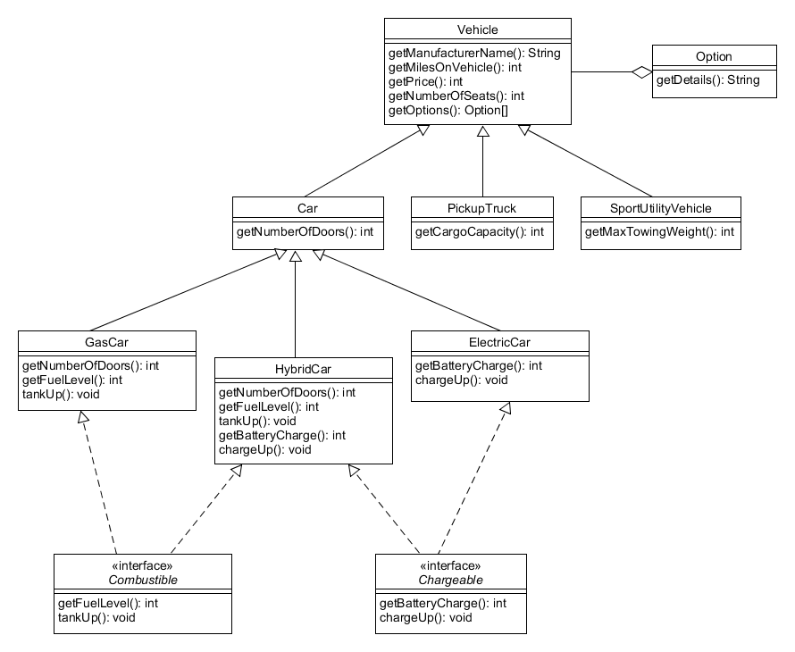

# JavaOODesign
 _(derived from CISC191ObjOrientedDesign)_

Java Test Driven Development (TDD) project to program Java classes with unit testing ( with **JUnit** )

________

# San Diego Mesa College CISC 191 Programming Challenges
Programming challenges for San Diego Community College CISC 191 Intermediate Java classes.

Created by
- Professor Dr. Tasha Frankie
- and Professor [Allan Schougaard](https://github.com/schougaard), San Diego Mesa College.

With contributions from: 
- Dom David,
- [Dan Sullivan](https://github.com/uid100)

________

## Assignment Overview
Object-oriented programming (OOP) is a programming paradigm that is widely used in Java. OOP is a programming style that emphasizes the use of objects, which are instances of classes, to represent data and methods that operate on that data. OOP provides a clear structure for programs, making them easier to maintain, modify, and debug. It also helps to keep the code DRY (Don’t Repeat Yourself) by reducing the repetition of code. OOP makes it possible to create full reusable applications with less code and shorter development time. Java’s OOP features include classes, objects, inheritance, encapsulation, and polymorphism.

Interfaces and abstract classes are important in Java OOP for several reasons. Both of these concepts allow developers to create more flexible and modular code that can be easily extended and reused. Interfaces are used to define a set of methods that a class must implement. They provide a way to achieve abstraction in Java, which is one of the key features of OOP. Interfaces are useful when you want to define a contract that must be followed by any class that implements it. They also allow you to create code that is more loosely coupled, which makes it easier to maintain and modify. For example, you can define an interface for a database connection and then have multiple classes implement that interface to connect to different types of databases.

Abstract classes are similar to interfaces, but they can also include implemented methods. Abstract classes are used to provide a base class for concrete subclasses to inherit from. They allow you to define a set of methods that must be implemented by any subclass, while also providing some default behavior that can be inherited by those subclasses. Abstract classes are useful when you want to create a class hierarchy that shares some common functionality, but also has some unique behavior in each subclass.

By using interfaces and abstract classes, developers can create code that is more scalable and easier to maintain over time.  

________

## Instructions

## _(Open the Project)_
1. From the **<> Code** dropdown link in the repository (above), download the Zip file to your computer.
2. Extract the files to your working folder
3. Open Eclipse and import the project. 
   - You can use File>Import menu item or right-click in the Package Manager and choose Import.
   - select General>Projects from Folder or Archive
   - navigate into the project until you see the `bin` and `src` folders, and choose *open*
4. Expand the project in the package explorer and find the .java files below the **src** folder.

## _(Complete the Assignment)_
The layout of this project is similar to the the java classes lab. You will implement the logic of several java classes and interfaces..

___________

## Programming Task(s)

    
testVehicle

    <ol>
        <li>Open the Vehicle class and include the missing elements. Use the diagram to help guide you. What you see in the diagrams above shows information regarding the method headers. For example, getManufacturname is the name of one of the methods and returns a String.</li>
        <li>The only weird part about this one is the last parameter of the constructor. It requires an Option type. Create a blank Option class now so that you can use it as a type. Note that the instance variable for this will be an array of options.</li>
        <li>Other than the Option class, the rest of the tests are strictly getters to check that the instance variables of a Vehicle object are being set properly.</li>
    </ol>

    
testOptions

    It's time to expand on the Option class. You will see that an option will keep track of a String to describe the option.</h4>
    <ol>
        <li>Add the missing instance variable</li>
        <li>Add the constructor so that can create an Option object with a given String (the "option").</li>
        <li>Add the getter, but the getter must be specifically called getDetails</li>
        <li>At this point, if you missed the fact that the Vehicle must have an array of Option objects then go back to Vehicle and make sure one of the instance variables is an array of Option objects. Your constructor's parameter list should match this change.</li>
        <li>Add the getOptions method in Vehicle which returns the array of Option objects.</li>
    </ol>

    
testCar

    

        Revisit the diagram to see what the relationship of a Car is to Vehicle. Remember, do not re-declare instance variables that come from the superclass!
        <ol>
            <li>Add the Car class. What class does it extend? Make sure your class header reflects the proper relationship.</li>
            <li>You'll notice that the constructor has an additional parameter in the parameter list. What might this be? Add the corresponding instance variable for it. </li>
            <li>Add the constructor. Make sure to call the super constructor here.</li>
            <li>Add the missing method from the diagram.</li>
        </ol>

    
testPickUpTruck

        <ol>
            <li>Create the PickUpTruck class</li>
            <li>Look at the diagram to figure out what instance variable is unique to a PickUpTruck</li>
            <li>Did you extend the right class based on the diagram?</li>
            <li>Add the missing constructor. You may need to add an additional parameter in the parameter list to account for the instance variable in PickUpTruck. This is similar to what you had to do for Car.</li>
            <li>Add the missing method. What instance variable does it return?</li>
        </ol>

    
testSportsUtilityVehicle

        <h4><i>Same process as Car and PickupTruck</i></h4>

    
testGasCar

        <ol>
            <li>Create the necessary class and make sure it extends the correct class per the diagram.</li>
            <li>This one does not have a lot to it because it inherits a lot of the behaviors of its superclasses in the multi-level inheritance as shown in the diagram. (not the same as multiple inheritance)</li>
        </ol>

    
testCarIsCombustible

        <ol>
            <li>Per the diagram, Combustible is an interface that will be used by the GasCar and the HybridCar classes. Create the interface.</li>
            <li>Add the method headers. Remember the methods do not have bodies in interfaces. They describe the desired behavior only.</li>
        </ol>

    
testCarIsChargeable

        <ol>
            <li>Create the corresponding Interface</li>
            <li>Add the method headers. Remember, interfaces do not implement the body of the methods.</li>
        </ol>

    
Others

    There are things repeated in this lab. Testers not mentioned would follow the same testing methodology.

___________

## Complete and zip the project
1. Run and add the code to the src folder until the tests are successful.
2. Uncomment each test case in the **Test** file, one at a time. 
Do not modify the content in this file except to uncomment the tests. Add and modify class files
as needed for the tests to pass.
3. Review and refactor any of the code as needed:
    - be sure your code follows good coding practices and coding style and standards.
    - update the javadoc comments at the top of the file to add your name as author
    - update the comments for each method in the file.
4. Export the project as a zip file and submit your work.

___________

## Rubric

[Rubric](Rubric.md)

___________

_this repository is a subset of the CISC191 exercises. It is derived from the CISC191ProgrammingChallenges 
activity hosted by Professor Allan Schougaard, San Diego Mesa College, and not a direct fork._

_This project is to decompose that repository into git submodules_
